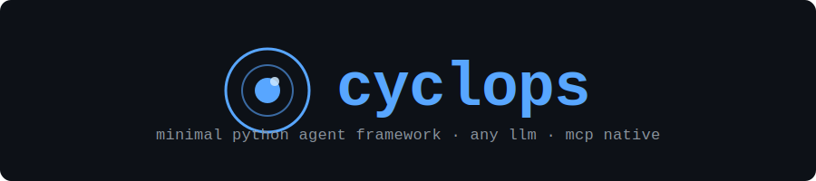

# Cyclops

Cyclops is a lightweight Python agent framework that lets you build LLM-powered agents with tools, memory, structured output, and multi-provider support: all in a few lines of code. It sits on top of [LiteLLM](https://github.com/BerriAI/litellm), so any model that LiteLLM supports (OpenAI, Anthropic, Groq, Ollama, Together AI, and 100+ more) works without changing your code.

## Key features

- **Any LLM provider**: OpenAI, Anthropic, Groq, Ollama, and every provider LiteLLM supports via a single `model=` string.
- **Tool use**: Decorate a plain Python function with `@tool` and pass it to the agent. Supports both sync and async tools.
- **Structured output**: Pass a Pydantic model as `response_model` and get a typed object back instead of a string.
- **Streaming**: True token-by-token streaming for no-tool runs; streamed final answer after tool calls for tool runs.
- **Memory**: `InMemoryStorage` for ephemeral state and `FileStorage` for JSON-backed persistence across restarts.
- **Cost & token tracking**: `run_with_response()` returns an `AgentResponse` with prompt tokens, completion tokens, and estimated cost.
- **MCP support**: Expose Cyclops tools as an MCP server or consume any MCP server as a tool source.
- **Plugin system**: Package tools as `Toolkit` classes and distribute them as Python packages with entry-point auto-discovery.
- **Hooks**: Subclass `AgentHooks` to observe every LLM call, every tool execution, and optionally block tools at runtime.
- **Router support**: Pass a LiteLLM `Router` for automatic fallback, retries, and load balancing across backends.

## Quick install

```bash
pip install cyclops-ai
```

Or with uv (recommended):

```bash
uv add cyclops-ai
```

## Hello world

```python
from cyclops import Agent, AgentConfig

config = AgentConfig(model="groq/llama-3.1-8b-instant")
agent = Agent(config)

response = agent.run("What is the capital of France?")
print(response)
```

Set your API key once and you're running:

```bash
export GROQ_API_KEY="your-key-here"   # free at console.groq.com
```

---

Ready to go deeper? Head to the [Getting Started](getting-started.md) guide.
